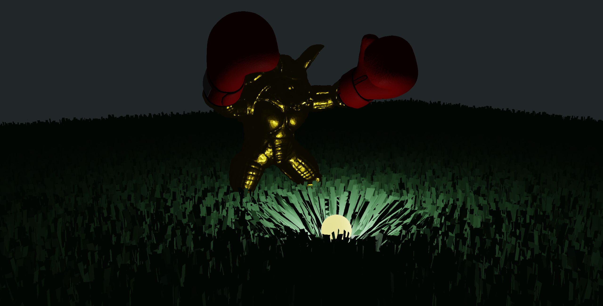
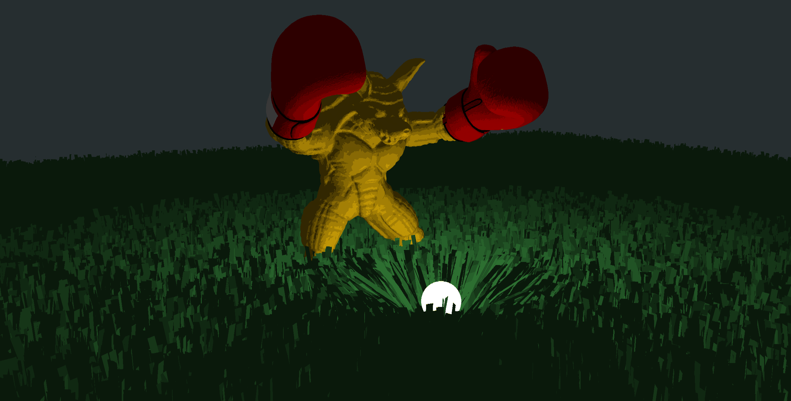
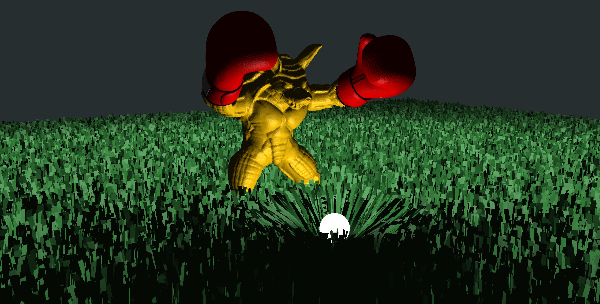
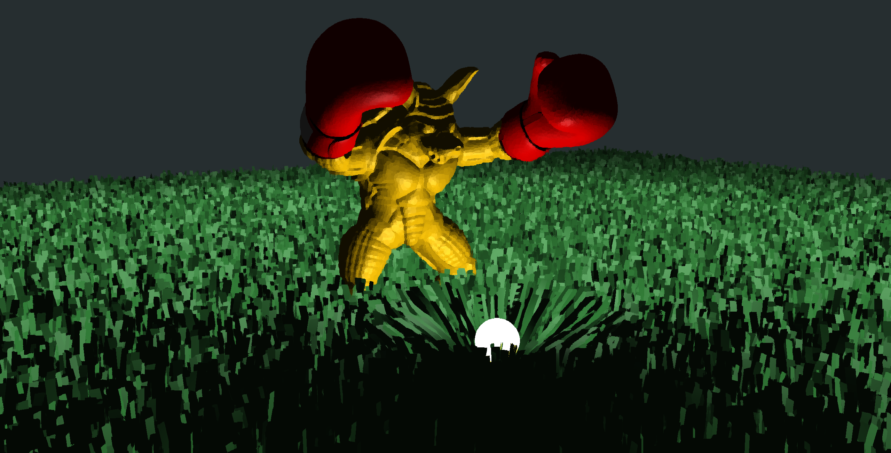
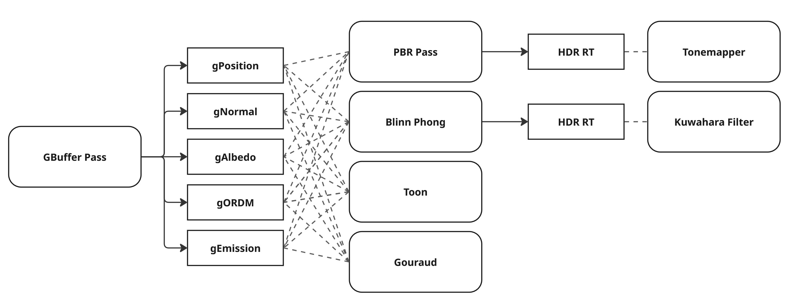
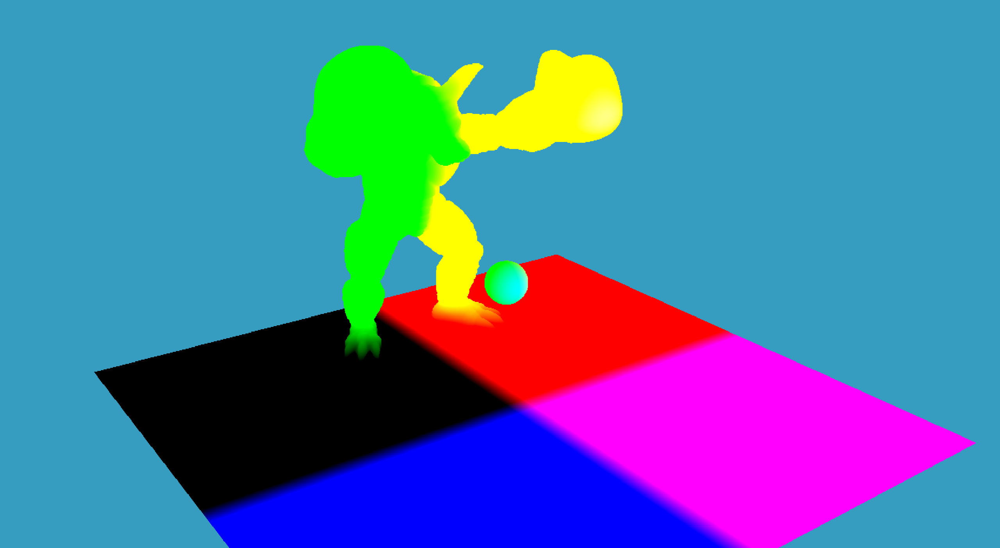
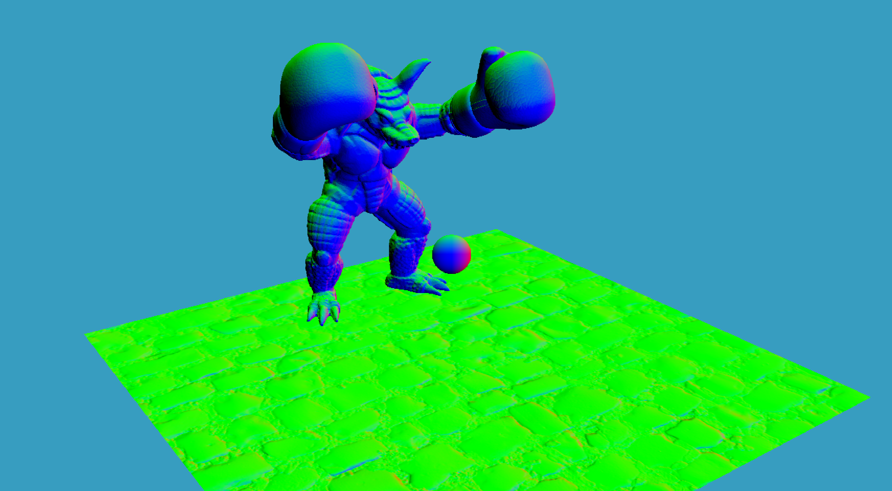
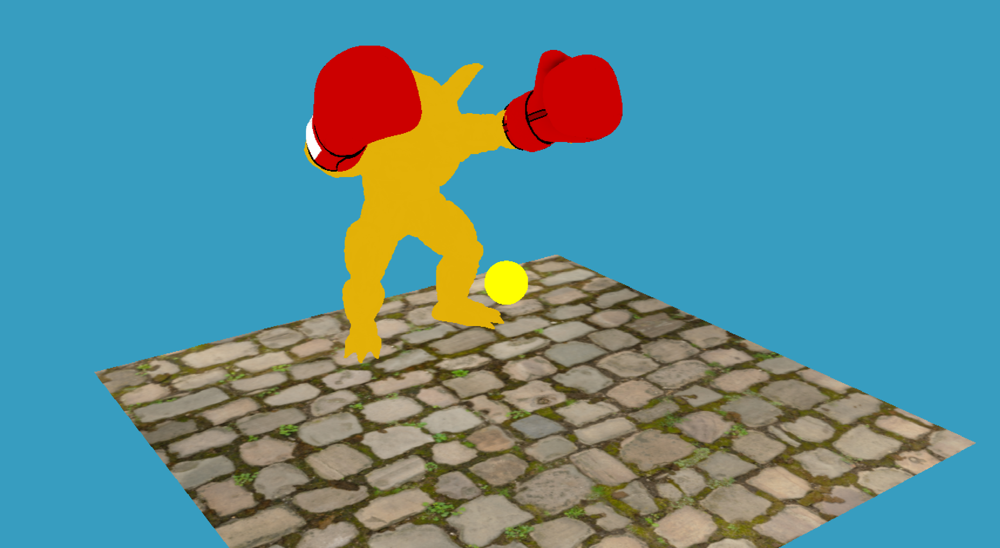
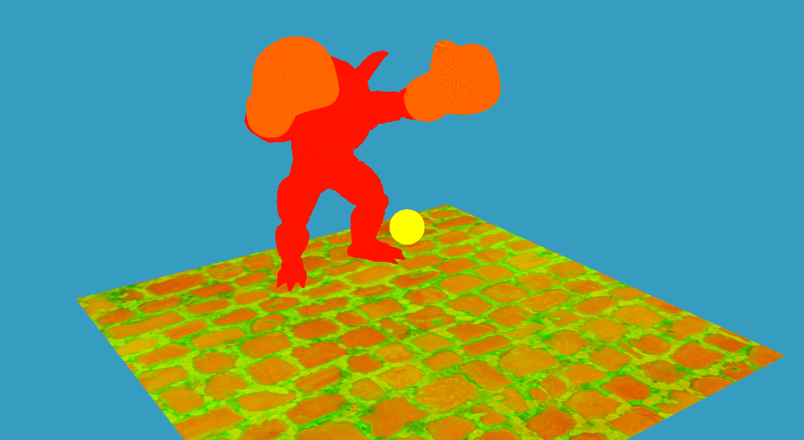

# Three.js Deferred Renderer

This is a basic deferred pipeline visualizer using MRTs to create the G-buffer, with multiple types of lighting models and posts processing.

Grass rendering by mesh instancing is also implemented.

<table cellpadding="0" cellspacing="0" border="0" style="border-collapse:collapse; width:100%;">
  <tr>
    <td style="padding:0; width:50%; text-align:center; vertical-align:middle;">
      <div style="display:inline-block; text-align:center;">
        
        <div style="margin-top:6px; font-size:13px;">PBR Tonemapped</div>
      </div>
    </td>
    <td style="padding:0; width:50%; text-align:center; vertical-align:middle;">
      <div style="display:inline-block; text-align:center;">
        
        <div style="margin-top:6px; font-size:13px;">Toon Shading</div>
      </div>
    </td>
  </tr>

  <tr>
    <td style="padding:0; width:50%; text-align:center; vertical-align:middle;">
      <div style="display:inline-block; text-align:center;">
        
        <div style="margin-top:6px; font-size:13px;">Blinn Phong</div>
      </div>
    </td>
    <td style="padding:0; width:50%; text-align:center; vertical-align:middle;">
      <div style="display:inline-block; text-align:center;">
        
        <div style="margin-top:6px; font-size:13px;">Post Process Isotropic Kuwahara Filter</div>
      </div>
    </td>
  </tr>
</table>


## Project Setup
### Prerequisites
- Modern Browser with WebGL2 support (Chrome, Edge, Firefox)
- Visual Studio Code (optional) with the **Live Server** extension for quick local viewing.

### Viewing Instructions
This project is mainly tested in VS Code (Live Server)
1. Install the Live Server extension in VS Code.
2. Open this project folder in VS Code.
3. Right-click index.html → Open with Live Server (or press the Live Server status bar button).
4. The page will open at http://127.0.0.1:5500/ (or a similar local URL).

## Controls

Main controls are the following:

- `O` to decrease the light radius
- `P` to increase the light radius
- `G` to toggle the grass on and off

Render passes are mapped to number key rows:

- `1` - Tonemapped PBR
- `2` - PBR
- `3` - Blinn Phong
- `4` - Toon shading (based on lambert with a quantized light falloff)
- `5` - Gouraud shading (fake, deferred version)
- `6` - GBuffer Position
- `7` - GBuffer Normal
- `8` - GBuffer Albedo
- `9` - GBuffer ORDM, Packed (Ambient Occlusion, Roughness, Displacement, Metallic)
- `0` - Post Process: Isotropic Kuwahara (from Blinn Phong base)

> Note: I standardized the label to ORDM everywhere and spelled out the channel mapping.

## Feature Details

### Deferred Rendering

Deferred rendering is mainly used for visualization purposes on this project. The diagram below sums up the changes in the render pipeline:



_Rounded rectangles are shaders, other are render targets._

Each geometry pass stores data that are needed for lighting calculations. This means setting up `gshaders` that are appropriate for each object. For example, we use `g-deformation.vs.glsl` and `g-tinting.fs.glsl` for the armadillo to keep the original features of part 1, while the rest uses a default `g-shader.vs.glsl` and `g-shader.fs.glsl` shader program.

<table cellpadding="0" cellspacing="0" border="0" style="border-collapse:collapse; width:100%;">
  <tr>
    <td style="padding:0; width:25%; text-align:center; vertical-align:middle;">
      
    </td>
    <td style="padding:0; width:25%; text-align:center; vertical-align:middle;">
      
    </td>
    <td style="padding:0; width:25%; text-align:center; vertical-align:middle;">
      
    </td>
    <td style="padding:0; width:25%; text-align:center; vertical-align:middle;">
      
    </td>
  </tr>
</table>


For visualizing each render target, we have to store them to be used for the render loop or for another pass:

```js
// HDR target for lighting result
const pbrRT = new THREE.WebGLRenderTarget(width, height, {
  minFilter: THREE.LinearFilter,
  magFilter: THREE.LinearFilter,
  type: THREE.FloatType,
  format: THREE.RGBAFormat,
  depthBuffer: false,
});
window.pbrRT = pbrRT;
```

> Note: PBR shader is adapted from _LearnOpenGL_’s PBR materials (Cook–Torrance BRDF with GGX normal distribution, Schlick Fresnel, Smith geometry) and reference from my prior implementations in my personal repository: https://github.com/jamesedra/Engine-0/tree/main/Engine-0/shaders

### Grass Instancing

The scene currently renders around 250,000 grass blased in a single draw using `THREE.InstancedMesh`.

I used `THREE.InstancedBufferAttribute` to bind per buffer data attributes and passed to `g-grass` shader program. Attributes are as follows:

- `instanceOffset`: `vec3` world-space X/Z placement
  `instanceRotation`: `float` random Y rotation per blade
- `instanceScale`: `float` size variation
- `instanceSeed`: `float` randomness for wind animation

Uniforms are also passed for the animation and the light orb interaction effect:

- `uTime`
- `uWindDir (vec3)`, `uWindAmp (float)`
- `uHitAmp (float)`: impact bend strength from the orb
- `orbPosition (vec3)`, `orbRadius (float)`: impact source

## Implementation notes

### Three.js version

The version of three.js in this project is r181 to support MRT setup for the GBuffer and multiple color attachments:

```js
// Creates GBuffer
const gBuffer = new THREE.WebGLRenderTarget(width, height, {
  count: 5,
  minFilter: THREE.NearestFilter,
  magFilter: THREE.NearestFilter,
  type: THREE.FloatType,
  format: THREE.RGBAFormat,
  depthBuffer: true,
});
gBuffer.textures[0].name = "gPosition";
gBuffer.textures[1].name = "gNormal";
gBuffer.textures[2].name = "gAlbedo";
gBuffer.textures[3].name = "gORDM";
gBuffer.textures[4].name = "gEmission";
gBuffer.depthTexture = new THREE.DepthTexture(width, height);
gBuffer.depthTexture.type = THREE.UnsignedShortType;
window.gBuffer = gBuffer;
```

This also provides us a clean layout output on each geometry fragment shader passes:

```glsl
layout(location = 0) out vec4 gPosition;
layout(location = 1) out vec4 gNormal;
layout(location = 2) out vec4 gAlbedo;
layout(location = 3) out vec4 gORDM;
layout(location = 4) out vec4 gEmission;
```

### Imported modules

Some modules that are imported include `three.module.min.js`, `OrbitControls.js`, and `OBJLoader.js` in the three.js repository: https://github.com/mrdoob/three.js

`BufferGeometryUtils.js` and `mikktspace.module.js` were also added for computing tangent and bitanget vectors.
